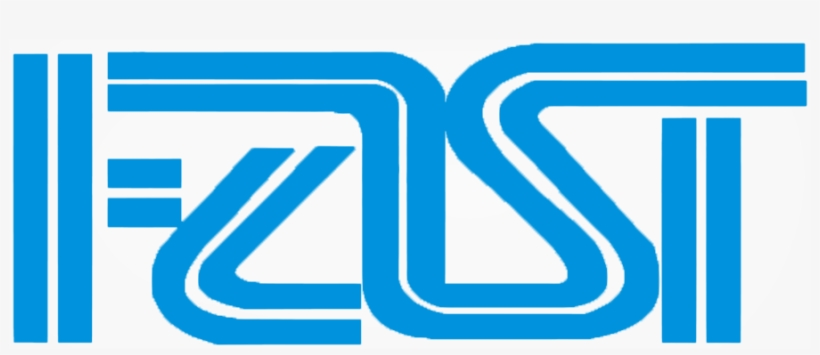

# 📚 DSA Lab – FAST NUCES (3rd Semester)

  

  
  
  
  

---

## 🚀 Overview  
This repository contains my **Data Structures & Algorithms (DSA) Lab work** for the **3rd Semester at FAST NUCES**.  
It includes all lab tasks, organized properly for reference and record keeping.  

---

## 📂 Repository Structure
📁 DSA-Lab  
 ┣ 📂 Lab01 - Revision Of Advanced OOP Concepts  
 ┣ 📂 Lab02 - 1D and 2D Dynamic Safe Pointers and Jagged Array  
 ┣ 📂 Lab03 - Linked Lists  
 ┣ 📂 Lab04 - Sorting Algorithms
 ┣ 📄 README.md  

---

## 🛠 Technologies
- **Language:** C++  
- **Tools:** VS Code / Dev C++ / CLion  
- **Version Control:** Git & GitHub  

---

## 🎯 Key Concepts Covered
- Arrays & Strings  
- Linked Lists  
- Stacks & Queues  
- Trees & Graphs  
- Searching & Sorting  
- Complexity Analysis   

---

## 🌟 Note
This repository is mainly for my own academic record and practice during the **3rd Semester at FAST NUCES**.  

---
